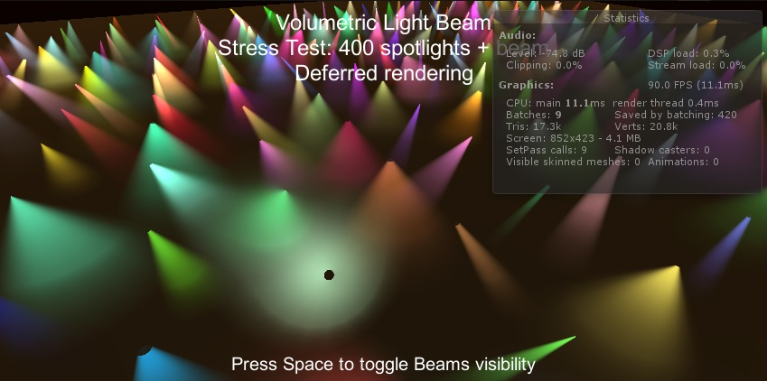
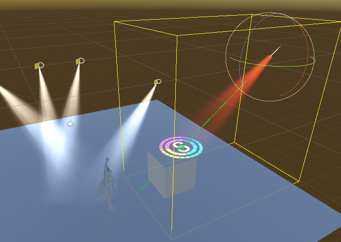

# VolumetricLight 
体积光

## 简介 
修改自assetstore 插件Volumetric Light Beam
(http://saladgamer.com/vlb-doc/)
修改为GPUInstance模式，减少DrawCall。
>Version
## SimpleProjector
投影器
通过射线，简单的投影一个Prefab实例。可以单独使用。

## UPdate
### 090514
LOD level1 将所有的计算移入到顶点计算中。减少像素计算
恢复了level1 对内外Alpha的支持
### 0190509
为了解决像素运算过高的问题,增加了LOD模式。
目前只有Level 0 使用原始运算，Level 1使用简化后算法。
移除了一些用不到的效果。